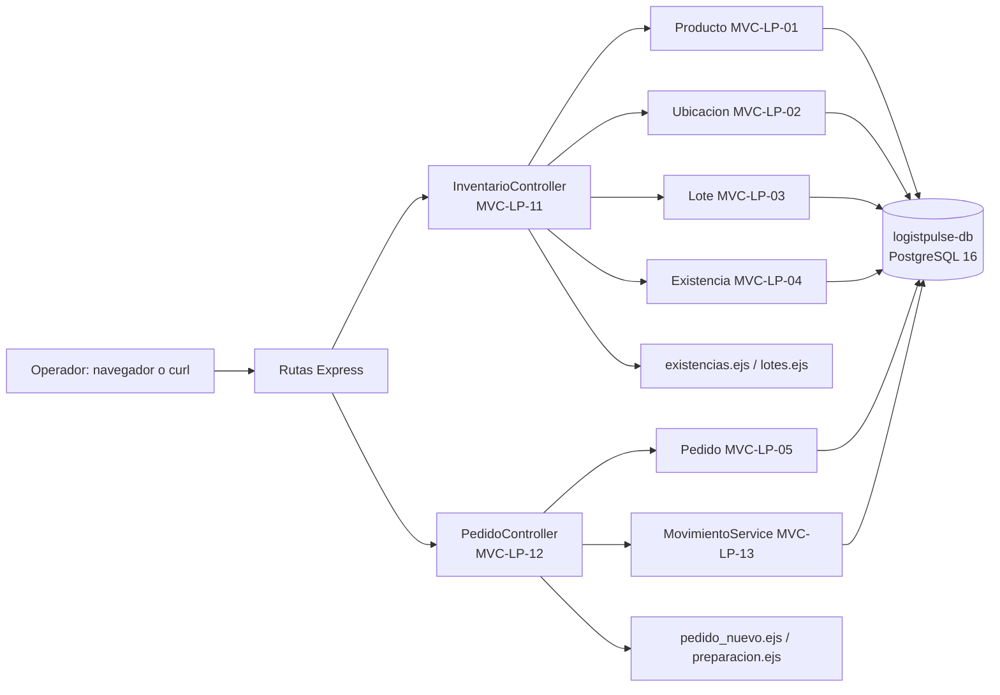

# LOGISTPULSE

LOGISTPULSE es el proyecto integrador de gestión de pedidos y logística (dominio operativo). Este repositorio contiene el esqueleto ejecutable del Sprint 1 (SPR-LP-01): consultar existencias por producto, lote y ubicación, registrar lotes con vencimiento, crear pedidos validando disponibilidad y prepararlos con descuento transaccional FEFO.

Documento de diseño asociado: *Value Recovery Journey* (Diseño de Sistemas, USFQ). Los IDs de este README (INC, HU, MVC, PR, SVC, PRB) son los mismos de la matriz de trazabilidad del documento.

## 1. Propósito y alcance

- **Incluye:** Épicas 1 y 2 en su núcleo (INC-LP-01 e INC-LP-02): HU-LP-01, HU-LP-02, HU-LP-04 y HU-LP-05, sobre un entorno Docker reproducible.
- **No incluye:** Despacho, recepción, rutas, seguimiento y flota (vehículos y ARM/AMR), integración con ERP y GPS (están en el backlog del documento de diseño).

## 2. Stack y versiones

| Componente | Versión |
|---|---|
| Node.js | 20 (imagen `node:20-alpine`) |
| Express | 4.x |
| EJS (Vistas) | 3.x |
| PostgreSQL | 16 (imagen `postgres:16-alpine`) |
| Docker Compose | v2 (plugin `docker compose`) |

Arquitectura MVC: rutas Express → Controlador → Modelo (SQL parametrizado con `pg`) → Vista EJS (o JSON si la cabecera `Accept` es `application/json` o se agrega `?formato=json`).

## 3. Requisitos previos

- Docker Desktop (o Docker Engine con Compose v2) o GitHub Codespaces.
- Git. Node.js 20 solo es necesario si quiere ejecutar `scripts/smoke.js` desde el host (no hace falta si usa `docker compose exec`).
- Puerto libre `3002` en el host.

## 4. Configuración de variables de entorno

```bash
cp .env.example .env        # PowerShell: Copy-Item .env.example .env
```

| Variable | Valor de ejemplo | Descripción |
|---|---|---|
| `API_PORT` | `3002` | Puerto del host donde se publica la API (dentro del contenedor es 3000) |
| `DB_NAME` | `logistpulse` | Nombre de la base de datos |
| `DB_USER` | `logistpulse_user` | Usuario de la base de datos |
| `DB_PASSWORD` | `cambiar_en_local` | **Obligatoria.** Cambie el valor en su `.env` local; el archivo `.env` nunca se sube al repositorio |

## 5. Levantar, probar y detener el entorno

```bash
docker compose up --build -d     # construir y levantar logistpulse-api y logistpulse-db
docker compose ps                # estado de los servicios (logistpulse-db debe quedar "healthy")
docker compose logs -f logistpulse-api     # logs de arranque
curl http://localhost:3002/health
docker compose down              # detener (conserva los datos)
docker compose down -v           # detener y borrar el volumen logistpulse_pgdata (vuelve a cargar la semilla)
```

Servicios y puertos:

| ID | Servicio | Puerto host | Notas |
|---|---|---|---|
| SVC-LP-01 | `logistpulse-api` | `3002` → 3000 | API Express; espera a que la base de datos esté saludable (`depends_on` con `service_healthy`) y además reintenta la conexión al arrancar |
| SVC-LP-02 | `logistpulse-db` | no publicado | PostgreSQL con el volumen `logistpulse_pgdata`; `db/init.sql` crea el esquema y los datos semilla solo la primera vez |

## 6. Endpoint de salud y operaciones demostrables

`GET /health` responde HTTP 200 con `{"estado":"ok","servicio":"logistpulse-api","base_de_datos":"ok"}` (503 si la base de datos no responde).

| Método | Ruta | Controlador | Historia |
|---|---|---|---|
| GET | `/health` | `SaludController.estado` | TEC-LP-02 |
| GET | `/inventario?producto=&ubicacion=` | `InventarioController.consultar` | HU-LP-01 |
| POST | `/lotes` | `InventarioController.registrarLote` | HU-LP-02 |
| POST | `/pedidos` | `PedidoController.crear` | HU-LP-04 |
| POST | `/pedidos/:id/preparar` | `PedidoController.preparar` | HU-LP-05 |

Ejemplos:

```bash
# 1) Salud
curl http://localhost:3002/health

# 2) HU-LP-01: existencias de SKU-001 por lote, con cantidad disponible
curl -H "Accept: application/json" "http://localhost:3002/inventario?producto=SKU-001"

# 3) HU-LP-02: registrar un lote (cambie codigo_lote y use una fecha de vencimiento futura)
curl -X POST http://localhost:3002/lotes -H "Content-Type: application/json" -H "Accept: application/json" \
  -d '{"sku":"SKU-002","codigo_lote":"L-DEMO-01","ubicacion":"A-01-01","cantidad":10,"fecha_vencimiento":"2027-06-30"}'

# 4) HU-LP-04: crear un pedido (reserva existencias por FEFO)
curl -X POST http://localhost:3002/pedidos -H "Content-Type: application/json" -H "Accept: application/json" \
  -d '{"cliente":"CLI-001","lineas":[{"sku":"SKU-001","cantidad":2}]}'

# 5) HU-LP-05: preparar el pedido (use el id devuelto en el paso 4)
curl -X POST -H "Accept: application/json" http://localhost:3002/pedidos/1/preparar
```
En Windows PowerShell use `curl.exe` o, más simple, ejecute las pruebas automáticas (sección siguiente). En el navegador: <http://localhost:3002/inventario>.

## 7. Pruebas

```bash
docker compose exec logistpulse-api node scripts/smoke.js all
```

Secciones: `health`, `hu01`, `hu02`, `hu04`, `hu05`. La prueba de rollback (CA-LP-05-3) es aparte: `docker compose exec logistpulse-api node scripts/prueba_rollback.js`. Cada prueba imprime `PASS` o `FAIL` por criterio de aceptación (CA) y termina con código distinto de cero si algo falla. Desde el host: `BASE_URL=http://localhost:3002 node scripts/smoke.js all`.

## 8. Estructura de carpetas

```
logistpulse-app/
├── Dockerfile · docker-compose.yml · .env.example · .dockerignore · .gitignore
├── package.json · package-lock.json
├── db/init.sql                      # esquema y datos semilla
├── scripts/  smoke.js · prueba_rollback.js
├── .github/pull_request_template.md
└── src/
    ├── app.js · config/db.js · routes/index.js
    ├── controllers/  SaludController, InventarioController, PedidoController
    ├── models/       Producto, Ubicacion, Lote, Existencia, Pedido
    ├── services/     MovimientoService
    └── views/        inventario/{existencias,lotes}.ejs · pedidos/{pedido_nuevo,preparacion}.ejs
```

## 9. Arquitectura



El diagrama completo, con la justificación de diseño, está en el documento de diseño (capítulo de arquitectura MVC).

## 10. Trazabilidad del Sprint 1

| Historia | MVC | PR | Prueba |
|---|---|---|---|
| HU-LP-01 | MVC-LP-01 (en PR-LP-01), 02, 04, 06, 11 | PR-LP-02 | PRB-LP-01 |
| HU-LP-02 | MVC-LP-03, 04, 07, 11 | PR-LP-02 | PRB-LP-02 |
| HU-LP-04 | MVC-LP-04, 05, 08, 12 | PR-LP-03 | PRB-LP-03 |
| HU-LP-05 | MVC-LP-03, 04, 05, 09, 12, 13 | PR-LP-03 | PRB-LP-04 y PRB-LP-04b (rollback) |

## 11. Flujo de trabajo en Git (GitHub Flow)

- `main` siempre debe levantar con `docker compose up --build`.
- Cada cambio entra por una rama `feature/<ID>-<descripción>` (por ejemplo `feature/HU-LP-01-02-inventario-lotes`) y un Pull Request con la plantilla de `.github/pull_request_template.md`.
- Commits: `<tipo>(<ID>): <descripción en imperativo>`, por ejemplo `feat(HU-LP-01): ...`.
- Todo PR necesita la revisión de otro integrante antes de fusionarse (merge commit).
- Orden: primero se fusiona el PR-01 (esqueleto); después el PR-02 y el PR-03 pueden fusionarse en cualquier orden. Mientras un PR de historias no esté fusionado, su ruta responde `501 Pendiente de implementar`.

## 12. Solución de problemas frecuentes

- **`DB_PASSWORD` is required / «Defina DB_PASSWORD»:** falta el archivo `.env`; ejecute `cp .env.example .env`.
- **`port is already allocated`:** otro programa usa el puerto `3002`; cambie `API_PORT` en `.env` y vuelva a ejecutar `docker compose up -d`.
- **La API reinicia o dice «no disponible (intento n/30)»:** la base de datos aún arranca; espere unos segundos y revise `docker compose logs logistpulse-db`.
- **Cambié `db/init.sql` y no veo los cambios:** el script solo corre al crear el volumen; ejecute `docker compose down -v` y levante de nuevo.
- **`password authentication failed`:** cambió `DB_PASSWORD` después de crear el volumen; ejecute `docker compose down -v`.
- **Pedido responde 409 «Stock insuficiente»:** pida menos cantidad o registre un lote con `POST /lotes`.
- **Existencias con `cantidad_reservada` alta:** los pedidos en estado CREADO reservan stock hasta que se preparan; recree el volumen para volver a la semilla.
- **Codespaces:** abra la pestaña *Ports* y confirme que el puerto `3002` está publicado antes de abrir la URL.
- **No hay secretos en el repositorio:** `.env` está en `.gitignore`; solo se versiona `.env.example`.
